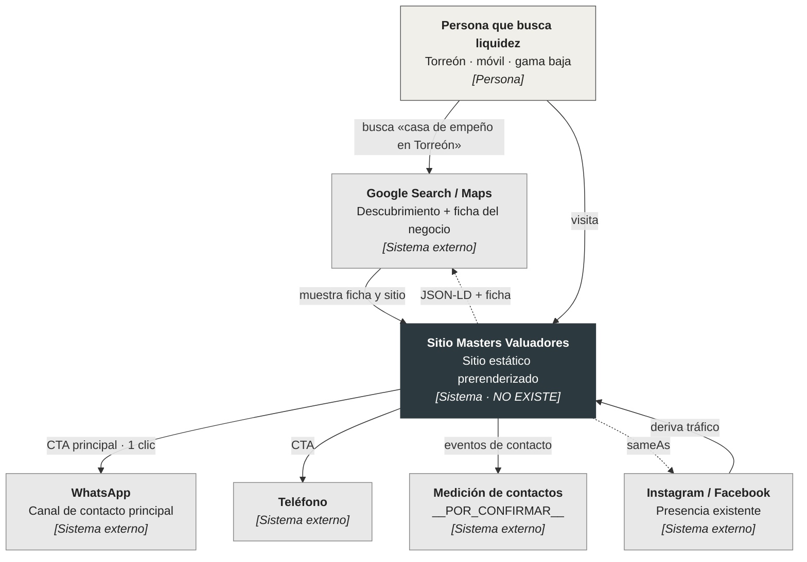

# C4 · L1 — Contexto del sistema

Qué es el sitio para el mundo exterior y con quién habla. **Nada aquí está
implementado**: el sistema no existe todavía.

## Evidencia por elemento

| Elemento | Grado | Fuente |
|---|---|---|
| WhatsApp como CTA principal, 1 clic | Documental | Propuesta, pág. 4 |
| Ficha de Google en el alcance | Documental | Propuesta, pág. 4 |
| Sitio rápido y móvil primero | Documental | Propuesta, pág. 4 |
| Medidor de contactos (llamada / WhatsApp / valuación) | Documental | Propuesta, pág. 4 |
| IG y FB activos | Documental | Propuesta, pág. 8 (11 seguidores IG, 3 459 publicaciones) |
| Herramienta concreta de medición | `__POR_CONFIRMAR__` | — [[decisiones-pendientes\|D-12]] |
| URLs exactas de IG/FB para `sameAs` | `__POR_CONFIRMAR__` | — [[decisiones-pendientes\|D-10]] |

"Documental" significa: está escrito en la propuesta firmada. **No** es grado A ni B —
no hay código todavía. Ver la tabla de grados en [[README]].

## Pendiente de validar contra Etapa 1

Este diagrama asume la lectura empeño-céntrica de la propuesta. Si la Etapa 1
concluye arquitectura multigiro, L1 cambia: la persona deja de ser una sola y
aparecen perfiles por giro. Ver [[decisiones-pendientes|D-05]].
