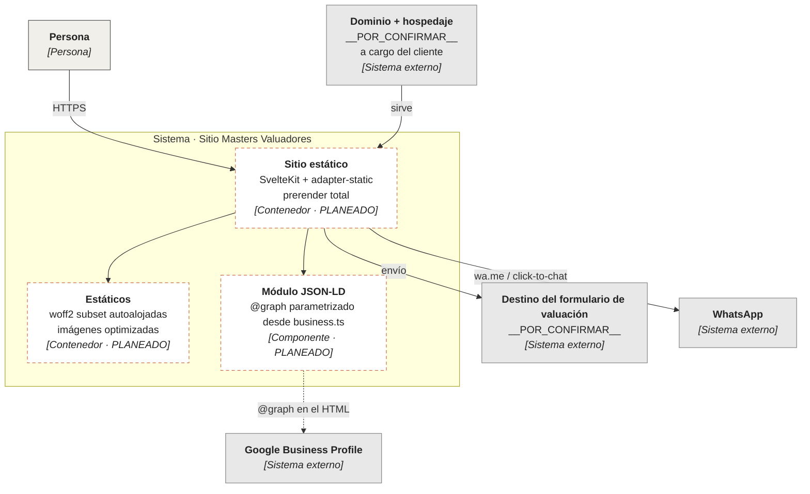

# C4 · L2 — Contenedores

Las piezas desplegables del sistema. **Ninguna existe todavía.**

Línea punteada naranja = **planeado**, sin una línea de código escrita.

## Decisiones de contenedor todavía abiertas

| # | Pregunta | Consecuencia si se equivoca |
|---|---|---|
| D-07 | ¿Dónde se hospeda y bajo qué dominio? | Define canónicas, `WebSite.url` y estrategia de despliegue |
| D-12 | ¿Qué medición de contactos? | Puede meter JS de terceros y reventar el presupuesto de 40 KB |
| D-13 | ¿A dónde llegan los envíos del formulario? | Un sitio 100 % estático **no** procesa formularios por sí solo. Si no hay destino, el formulario no se construye |

D-13 es la que puede romper la premisa de "estático puro". No la resuelvo yo.
