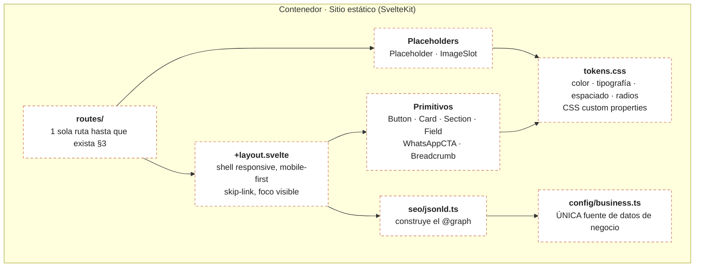

# C4 · L3 — Componentes del contenedor «Sitio estático»

Zoom dentro del contenedor web. **Todo PLANEADO.** Ningún archivo existe.

## Reglas que este nivel fija

1. `business.ts` es el **único** lugar donde vive un dato de negocio. Ningún
   componente escribe un teléfono, un horario ni un nombre legal.
2. `jsonld.ts` **solo** lee de `business.ts`. No acepta literales.
3. Los primitivos **solo** leen de `tokens.css`. Nada de hex sueltos.
4. Ninguna imagen real entra hasta que exista aprobación. `ImageSlot` pinta un
   bloque gris con la relación de aspecto y la etiqueta de qué foto va ahí.

Estas cuatro reglas son las que hacen que el test anti-`__POR_CONFIRMAR__` sea
capaz de bloquear un build de producción. Si un dato se filtra fuera de
`business.ts`, el test deja de servir.

## Estado

| Componente | Estado | Evidencia |
|---|---|---|
| Todos | NO INICIADO | — |

Se sube a IMPLEMENTADO archivo por archivo, con cita `ruta:línea`, no antes.
