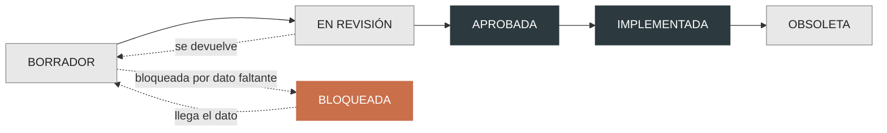

# SDD · Spec-Driven Development

Nada se implementa sin una spec aprobada. La spec es el contrato; el test es su
traducción ejecutable; el código es lo último.

## Estados

| Estado | Qué significa | Quién lo mueve |
|---|---|---|
| BORRADOR | Se está escribiendo | Quien la escribe |
| EN REVISIÓN | Lista para leerse | Autor |
| **BLOQUEADA** | Falta un dato de negocio o una decisión del cliente | Cualquiera, en cuanto lo detecta |
| APROBADA | Se puede implementar. Ni un archivo antes de esto | Nadir |
| IMPLEMENTADA | Todos los criterios tienen evidencia A o B citada | Autor, con las citas puestas |
| OBSOLETA | Reemplazada. Se conserva, no se borra | Nadir |

Una spec APROBADA no es evidencia de nada implementado. Es **planeado**.

## Orden de trabajo

1. Spec con criterios de aceptación numerados.
2. Un test por criterio. Falla. Se cita el test en la spec.
3. Código hasta que el test pase.
4. La spec sube a IMPLEMENTADA y cada criterio queda citado `ruta:línea`.

Si un criterio no se puede expresar como test, no es criterio: es una intención.
Se reescribe o se saca.

## Numeración

`SPEC-NNNN-slug-corto.md`, correlativo, sin reutilizar números.
Cada spec enlaza el nivel C4 que toca y los ADR de los que depende.

## Índice

| # | Spec | Estado |
|---|---|---|
| 0001 | [[SPEC-0001-armazon-fase-0]] | BORRADOR — lista para aprobar |
