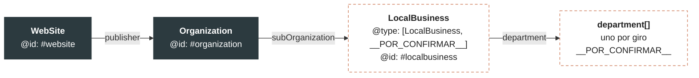

# §4 · Grafo JSON-LD

## Forma acordada

Un solo `@graph` con tres nodos enlazados por `@id`:

La forma está definida y, desde [[ADR-0003-alcance-multigiro]], la lista de
`department` también: **un `department` por giro de la §1**. Lo que sigue sin
definirse son los datos y el `@type` secundario.

## Origen de cada valor

Todo sale de `src/lib/config/business.ts`. `jsonld.ts` no acepta un solo literal.

| Campo | Valor hoy | Bloqueo |
|---|---|---|
| `Organization.name` | `__POR_CONFIRMAR__` | D-01 |
| `Organization.legalName` | `__POR_CONFIRMAR__` | D-01 |
| `Organization.url` | `__POR_CONFIRMAR__` | D-07 |
| `Organization.sameAs[]` | `__POR_CONFIRMAR__` | D-10 |
| `LocalBusiness.@type[1]` | `__POR_CONFIRMAR__` | D-02 · categoría primaria |
| `LocalBusiness.address` | `__POR_CONFIRMAR__` | D-08 |
| `LocalBusiness.telephone` | `__POR_CONFIRMAR__` | D-08 |
| `LocalBusiness.openingHoursSpecification` | `__POR_CONFIRMAR__` | D-08 |
| `LocalBusiness.geo` | `__POR_CONFIRMAR__` | D-11 |
| `LocalBusiness.department[]` | **Resuelto**: uno por giro | D-04 decide si importaciones sale del grafo |
| `WebSite.url` | `__POR_CONFIRMAR__` | D-07 |

## Regla de build

El build de producción **falla** si cualquiera de estos campos emite
`__POR_CONFIRMAR__`. Es CA-08 de [[SPEC-0001-armazon-fase-0]].

Motivo: un grafo con marcadores publicado en producción es peor que no tener
grafo. Google lo indexa, y desindexar cuesta más que retrasar.

## Lo que este grafo NO va a llevar

Sin evidencia documental del cliente, ninguno de estos entra:

`aggregateRating` · `review` · `priceRange` · `offers` con montos ·
`Service` con tasas o plazos.

Marcado de reseñas inventado es motivo de penalización manual. No se negocia.
