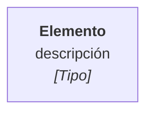

# C4 · LN — Título

## Evidencia por elemento
| Elemento | Grado | Fuente |
|---|---|---|

Grados: A (test) · B (código de producción) · Documental (propuesta o correo
firmado) · `__POR_CONFIRMAR__`. Documental no es A ni B.

## Pendiente
